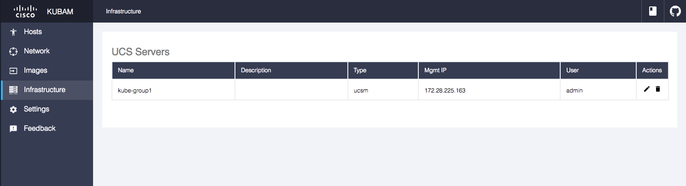

# KUBAM GUI

React+Redux front end to the [KUBAM](https://github.com/CiscoUcs/KUBAM) API server. 



## Purpose
The GUI aims to walk the user through the steps required to deploy an Operating system (and perhaps more) on top of UCS.  The steps are as follows: 

* Connect to UCS  
* Choose Network Settings
* Choose Servers from UCS for the server pool. Configure the host settings
* Choose the operating system settings: lay them out, templates, etc. 
* Deploy the system components. 

### 1. UCS Connection
This part is pretty straight forward.  Connect to UCS and enter credentials.  The front end contacts the [API server](https://github.com/CiscoUcs/KUBaM) and the credentials are then stored in the API database so it isn't required to enter anymore.  The front end recognizes that the API has the credentials and doesn't ask for them any more.  We are going a bit lax on security here and will need to fix this later. 

### 2. Network Settings

The User needs to pick from the UCS VLANs which VLAN to provision over for these server settings.  

## Run the app

```
npm start
```


## Code Structure

In the ```src``` directory there are the following:

* ```actions```: the ```index.js``` file holds all of the types of actions that can happen in the app. 
* ```components```
* ```containers```: Tie actions and components together.
* ```reducers```: Takes the actions and updates the state in the database.  

as well as the ```index.js``` which is the main starting point of the node application. 


## CI/CD

```
drone secret add -repository CiscoUcs/KUBAM-Frontend -image vallard/drone-spark -name SPARK_TOKEN -value YmI...
drone secret add -repository CiscoUcs/KUBAM-Frontend -image plugins/docker -name docker_username -value kubam
drone secret add -repository CiscoUcs/KUBAM-Frontend -image plugins/docker -name docker_password -value mysecret
drone secret add -repository CiscoUcs/KUBAM-Frontend -image appleboy/drone-ssh -name ssh_password -value secretpasswrd
```
